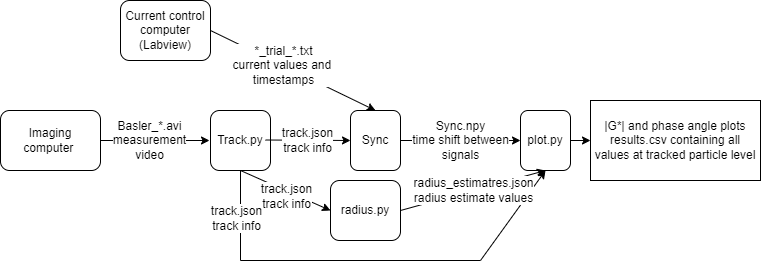

<div id="top"></div>


<!-- PROJECT LOGO -->
<br />
<div align="center">

  <h3 align="center">Microrheology Analysis Pipeline</h3>

  <p align="center">
    Authors: Ossi Arasalo and Arttu Lehtonen
    <br />
    Pokki Lab
    <br />
  </p>
</div>


<!-- TABLE OF CONTENTS -->
<details>
  <summary>Table of Contents</summary>
  <ol>
    <li><a href="#intro">Intro</a> </li>
    <li><a href="#tracker">Tracker</a></li>
    <li><a href="#sync">Syncronizer</a></li>
    <li><a href="#radius">Radius Estimator</a></li>
    <li><a href="#fit">Fit and Visualize</a></li>
  </ol>
</details>

<!-- ABOUT THE PROJECT -->
## Intro


 

### Requirements

```
pip install -r requirements.txt
```


# Pipeline

Our analysis pipeline is meant to analyze micromanipulation videos obtained via the measurement system introduced in X .The pipeline works as follows:

1. Particles are first tracked with ```track.py``` <br> Track all the files in the directory before moving to the next step.
2. Videos and current outputs from the coils has to be syncronized with ```sync.py```
3. Particles radius is estimated from separate sweep videos (manually changed focus over z) with ```radius.py```
4. Observed displacement signals are transformed into mechanical properties, namely to $|G|$ and $\phi$ with ```plot.py```. It also visualizes the results.

## Data folder structure 

```
- 22061401020201_A
  |- vid.mp4
  |- sweep.mp4
  |- current_trial_.txt
- 22061401020202_A
  |- vid.mp4
  |- current_trial_.txt
- 21081001010201_A
- 21081001010202_A
```

<br> Data can be found from: https://osf.io/jsxqh/ <br>

Each folder contains the timelapse video of particle movements (```vid.mp4```) (for instance output from [https://www.baslerweb.com/en/products/other-basler-software/basler-video-recording-software/](https://www.baslerweb.com/en/products/other-basler-software/basler-video-recording-software/). ```sweep.m4``` is the static video over the z stack, which is used to estimate the radius. This file has to be only in the first repeat. ```current_trial_.txt``` is the current output file.

**The naming convention is strict and the codes won't work if these are not followed**

```22061401020201_A```: 
* 220614: Year,month,day (zero padded 03 instad of 3)
* 01: sample 1
* 02: holder 2
* 02: location 2
* 01: repeat 1
* _A: sample matrix type

# Run instructions

## Tracker

Transform video into xy trajectories of particles.

```sh
python track.py -p ".../exampleData/Agarose30um/22061401020201_A"
```

2. i. Left click and drag a box around magnetic particles (drag from top left to bottom right) and release the left buttom. <br> press "q" to close the window <br>
 ii. Left click and drag a box around "small" reference particles (drag from top left to bottom right) and release the left buttom. <br> press "q" to close the window <br> iii. Left click and drag a box around cells (drag from top left to bottom right) and release the left buttom. <br> press "q" to close the window

3. Wait until tracking is over

## Syncronizer

The imaging and current control were performed with different computers that were not communicating with each others. Therefore, we needed to create an extra step to match the timestamps of the video and current file. Also absolute current values in the file are downscaled.

```sh
python sync.py -p ".../exampleData/Agarose30um"
```

2. Code displays current and displacement curves which both have calibration peaks in the beginning and in the end. The code automatically suggests a shif value. If it matches: i) close the window "q", ii) if you want to manual adjust the shift rough the shift value from top slider and fine tune <br>
   i) By default, the code displayes the average displacement within the field of view. Pressing "average" button, you can switch the the displacement of one big particle. This is useful of the curve is noisy<br>
   ii) if the autosyncronization is very off, you can pull the displacement curve to zero by pressing "local" button.<br>
  *** Event occurs when you move the slider next time<br>

# Match indices

Mathcing indices is not compulsory but is needed if the spheres are not tracked in the same order over the repeats or there is different number of particles tracked over the repeats.

```sh
python match_indices.py -p ".../exampleData/Agarose30um" --radius 61
```

# Radius Estimator

Radius estimate of the particle as a squared depence on |$G^*$|. We added an extra step to accurately define the size of each sphere. The code processes the z-swipe of the first repeat of each measurement and saves the results to later repeats

1. Run Radius Estimator code 
  ```sh
  python radius.py -p ".../exampleData/Agarose30um"
  ```
2. Code reads and processes the file: 1) reads the whole z-stack, 2) reads a cropped period of the video inwhich the maximum area is observed
3. Radius estimates of the particles are displayed. By submiting "n" on the command line, the estimates are accepted. Any other symbols rejects the estimates. On the command line, write indices of particles which radius estimate you want to manually determine. Separate indices by a ",". <br>
A crop of the particle is displayed, drag an circle around its contours by pressing left mouse button, and dragging it on the other side of the particle before releasing

### Optional arguments
* ```--no_init```: Choose boxes manually
* ```--no_visualize```: Do not visualize
* ```--no_copy```: Do not copy radius estimates to repeats
* ```--repeats```: Also estimate radius for repeats that are missing from repeat 1. This might be inaccurate because the magnetic particles may have moved during the repeats (so the position of the box is slighly wrong)

# Analyze and Plot the Results

This script uses the files produced by previous scripts to find |$G^*$| and $\phi$ values. 

1. Run code 
  ```sh
  python plot.py -p ".../exampleData/Agarose30um -s "particle size (30 or 100 )" -l "x label of the plots (day/concetration/current/sample/holder/location)"
  ```
Note: **concetration** or **current** are used in the paper

2. When the files are processed, results of spefic measurements are saved into their own folders and a summary of results and displayed plots are saved into a "results" folder created in ``` "*/example_files folder" ``` 


# Meta 

Force constants are hardcoded based on the particle size. Calibration codes are avalaible from us from request.

<!-- CONTACT -->
## Contact

- Ossi Arasalo  - ossi.arasalo@aalto.fi
- Arttu Lehtonen  - arttu.lehtonen@aalto.fi

Paper Link: [https://github.com/your_username/repo_name](https://github.com/your_username/repo_name)

